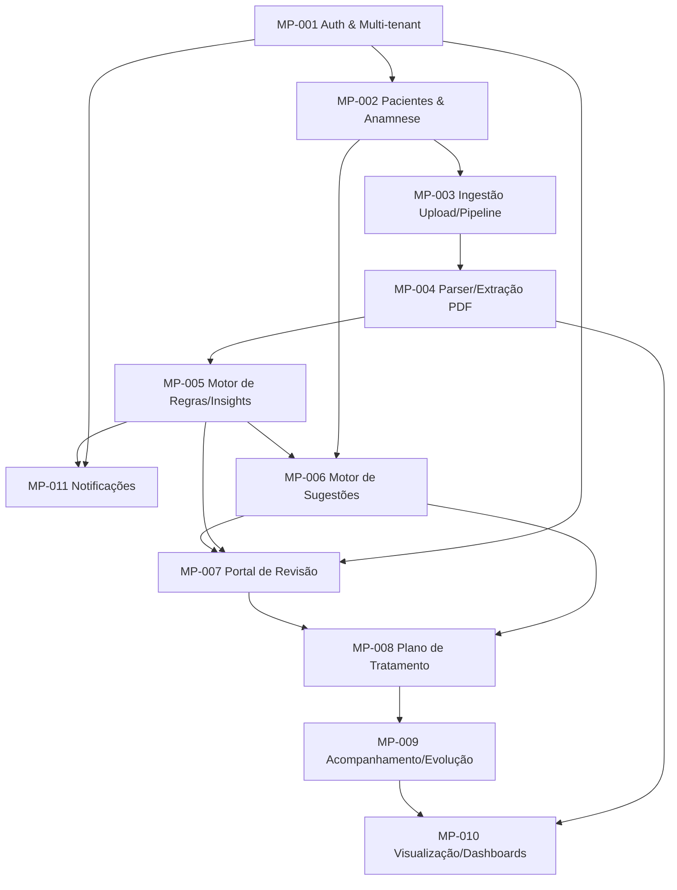

# STATUS — Hemograma Insights

## Fundação (MP-000)
```
[build-requirements] Progresso da Fundação
✅ 1-7. Todas as etapas — APROVADO
```

## Mini PRDs (split-miniprd)

| ID | Título | Depende de | Status | Dono provável |
|---|---|---|---|---|
| MP-001 | Auth & Multi-tenant | nenhum | pendente | Fundação de acesso |
| MP-002 | Cadastro de Pacientes & Anamnese | MP-001 | pendente | Cadastro |
| MP-003 | Ingestão de Exames: Upload & Pipeline | MP-002 | pendente | Infra de ingestão |
| MP-004 | Motor de Extração/Parsing de PDF | MP-003 | pendente | Parsing |
| MP-005 | Motor de Regras Clínicas & Insights | MP-004 | pendente | Regras clínicas |
| MP-006 | Motor de Sugestões | MP-005, MP-002 | pendente | Sugestões |
| MP-007 | Portal de Revisão do Médico | MP-001, MP-005, MP-006 | pendente | Revisão humana |
| MP-008 | Plano de Tratamento | MP-006, MP-007 | pendente | Plano |
| MP-009 | Acompanhamento & Evolução | MP-008 | pendente | Tracking |
| MP-010 | Visualização & Dashboards | MP-004, MP-009 | pendente | Gráficos |
| MP-011 | Notificações (WhatsApp/E-mail) | MP-001, MP-005 | pendente | Notificações |

## Grafo de dependências



## Ordem de execução sugerida (paralelismo)

- **Sequencial obrigatório (núcleo)**: MP-001 → MP-002 → MP-003 → MP-004 → MP-005
- **Podem rodar em paralelo após MP-005**: MP-006 e MP-011 (ambos só dependem de MP-005/MP-001, não um do outro)
- **Depende dos dois anteriores**: MP-007 (precisa de MP-005 e MP-006 prontos)
- **Sequencial final**: MP-007 → MP-008 → MP-009 → MP-010

## Próximos passos
- Rodar `miniprd-supervisor` em cada mini PRD conforme for marcado `em_teste`/`concluido` pelo executor, antes de liberar para `weld-system`.
- Nenhum mini PRD deve pular a fila de `miniprd-supervisor`, mesmo que pareça simples.
